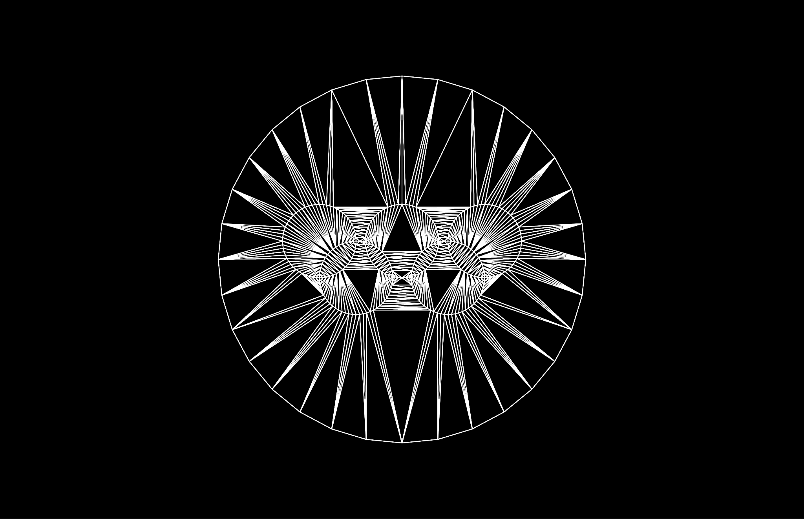

# CADET: Constrained Delaunay Triangulation

<p align="center">
  
</p>

<p align="center">
  <a href="https://github.com/yourusername/cdt"></a>
  <a href="https://github.com/yourusername/cdt"></a>
</p>

## Overview

CADET is a Rust library and CLI tool for performing Constrained Delaunay Triangulation (CDT) on geometric models. It supports reading constraint files, processing geometric data, and exporting triangulated meshes. This project demonstrates advanced computational geometry, robust Rust programming, and practical CLI design.

## Features

- **Constrained Delaunay Triangulation**: Efficient triangulation with support for geometric constraints.
- **Constraint File Support**: Load constraints from custom `.ct` files.
- **Mesh Export**: Export results to OBJ and GLB formats for use in 3D applications.
- **Font Asset Integration**: Includes font assets for rendering or annotation.
- **Modular Rust Codebase**: Well-structured modules for edges, faces, vertices, and triangulation logic.

## Example Images

<p align="center">
  
  
</p>

## Project Structure

```
assets/                # Font and other assets
constraints/           # Example constraint files (.ct)
models/                # Example models and outputs
src/                   # Rust source code
  cdt/                 # Core CDT logic
  constraints/         # Constraint handling
Cargo.toml             # Rust project manifest
README.md              # Project documentation
```

## Getting Started

### Prerequisites

- Rust (https://rustup.rs)

### Build

```powershell
cargo build --release
```

### Run Example

```powershell
cargo run --release -- src/main.rs
```

Or run with a constraint file:

```powershell
cargo run --release -- constraints/a.ct
```

### Output

- Triangulated mesh is saved as `output.obj` in the project root or `models/`.

## Usage

1. Place your constraint file in the `constraints/` folder.
2. Run the CLI with the path to your constraint file.
3. Find the output mesh in `models/` or as specified.

## Highlights

- **Algorithmic Complexity**: Implements CDT with robust edge and face handling.
- **Rust Mastery**: Uses advanced Rust features (traits, modules, error handling).
- **CLI Design**: User-friendly command-line interface.
- **3D Model Export**: Supports industry-standard formats.
- **Extensible**: Easy to add new constraints, formats, or algorithms.

## Example Constraint File

```text
# constraints/a.ct
# Format: x y
0.0 0.0
1.0 0.0
1.0 1.0
0.0 1.0
```

## Contributing

Pull requests and issues are welcome! For major changes, please open an issue first to discuss what you would like to change.

## License

Apache License 2.0. See `LICENSE` for details.

## Author

Martin Jakab (martinjakab01@gmail.com)

---
